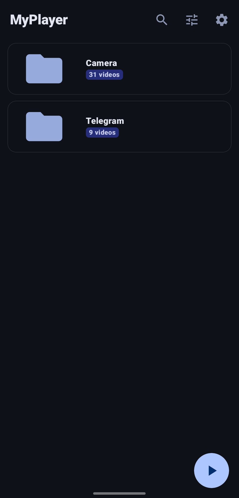
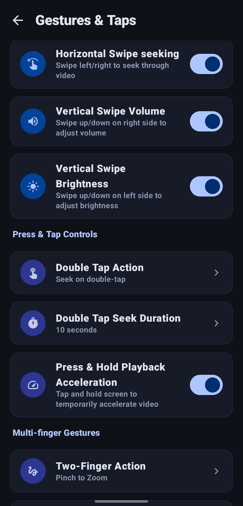
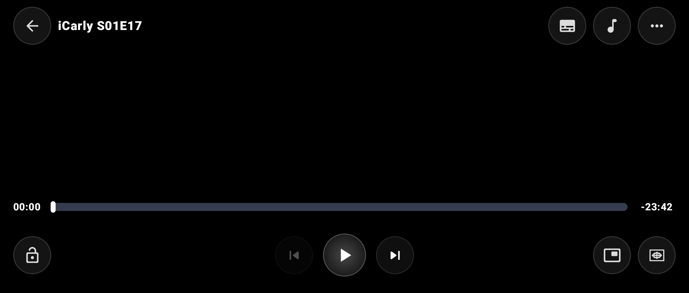
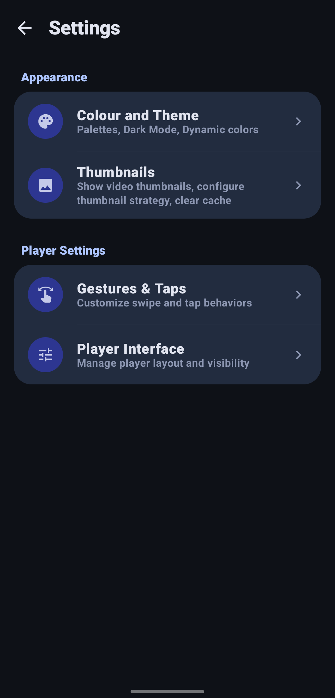
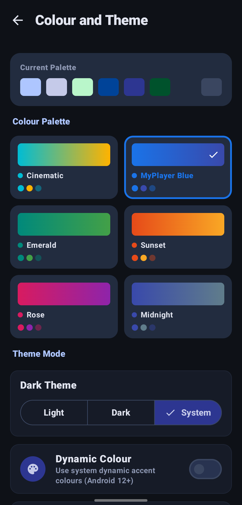

# MyPlayer

A beautiful, modern, high-performance Android video player based on MPV, featuring a stunning glassmorphic UI. Co-developed by Ahtisham Mir and AI.

> **Note:** This project is a modified fork of [Nosved-Player](https://github.com/DevSon1024/Nosved-Player) by DevSon1024.

## Key Features
- **Glassmorphism UI**: Sleek, transparent designs for list and grid views.
- **MPV Engine**: Powerful and reliable media playback.
- **Custom Aspect Ratio**: Fine-tune aspect ratios with an interactive dialer.
- **Dynamic Speed Controls**: Adjust playback speed intuitively.
- **Folder-based Browsing**: Clean navigation with isolated metadata toggles.
- **Persistent Top Status Bar**: Keeps track of video progress, device battery, and clock seamlessly.

## Screenshots

  
  
  
  
  
  

## Bug Reports & Issues
If you encounter any bugs or have feature requests, please use the GitHub Issues tracker:
[Report a Bug](https://github.com/mirahtisham13/MyPlayer/issues)

## Credits & Acknowledgements
- Developed by **[Ahtisham Mir](https://github.com/mirahtisham13)**
- Co-developed with AI.
- Original Base Project: **[Nosved-Player](https://github.com/DevSon1024/Nosved-Player)** by DevSon1024.
